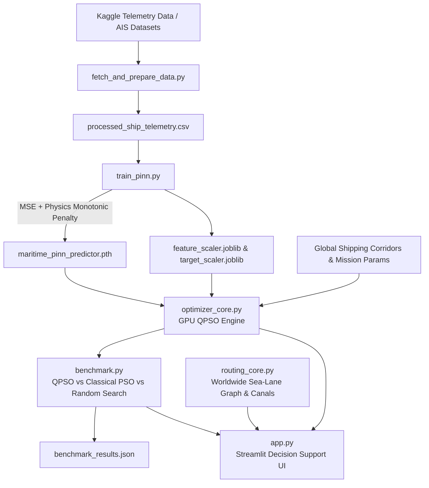

# ⚓ AURA-FLEET: Quantum-Inspired Green Maritime Fleet Optimizer

[](https://pytorch.org/)
[](https://developer.nvidia.com/cuda-zone)
[](https://streamlit.io/)
[](LICENSE)

An end-to-end **Physics-Informed Neural Network (PINN)** and **GPU Quantum-Inspired Particle Swarm Optimization (QPSO)** decision support system for maritime route planning, alternative fuel switching, and net-zero fleet logistics.

---

## 📋 Table of Contents
1. [Project Overview & Problem Statement](#-project-overview--problem-statement)
2. [Expected Deliverables Mapping](#-expected-deliverables-mapping)
3. [System Architecture](#-system-architecture)
4. [Mathematical Formulation](#-mathematical-formulation)
   - [Physics-Informed Neural Network (PINN)](#1-physics-informed-neural-network-pinn)
   - [Multi-Objective Optimization Problem](#2-multi-objective-optimization-problem)
   - [Quantum-Inspired PSO (QPSO) Engine](#3-quantum-inspired-pso-qpso-engine)
5. [Project Directory & File Map](#-project-directory--file-map)
6. [Installation & Environment Setup](#-installation--environment-setup)
7. [Step-by-Step Execution Pipeline](#-step-by-step-execution-pipeline)
   - [Step 1: Ingest & Preprocess Real Telemetry](#step-1-ingest--preprocess-real-telemetry)
   - [Step 2: Train the Maritime PINN Predictor](#step-2-train-the-maritime-pinn-predictor)
   - [Step 3: Run the Classical Benchmark Suite](#step-3-run-the-classical-benchmark-suite)
   - [Step 4: Launch the Interactive Web Dashboard](#step-4-launch-the-interactive-web-dashboard)
8. [Benchmarking & Empirical Results](#-benchmarking--empirical-results)
9. [Alternative Fuel & Decarbonization Matrix](#-alternative-fuel--decarbonization-matrix)

---

## 🌊 Project Overview & Problem Statement

The maritime and international logistics industries are under intense regulatory pressure (e.g., IMO 2030/2050, EU ETS, FuelEU Maritime) to drastically cut greenhouse gas emissions while preserving operational efficiency and schedule integrity. Fuel consumption represents 50–60% of total vessel operating costs and generates the vast majority of environmental emissions.

Traditional route planning and bunker optimization methods struggle with:
- High-dimensional, non-linear hydrodynamics (cubic speed power laws, sea state wave resistance, draft/beam displacement).
- Multi-fuel trade-offs (combining energy densities, cost per ton, and Well-to-Wake CO₂ intensities).
- Complex constraints (strict ETA deadlines, carbon tax penalties, cargo demand satisfaction).

**AURA-FLEET** resolves this by fusing:
1. **Physics-Informed Deep Learning**: Enforcing physical monotonicity ($\frac{\partial \text{Fuel}}{\partial \text{Speed}} \ge 0$) to eliminate unphysical neural network drift in unobserved speed regimes.
2. **Quantum-Inspired Swarm Optimization (QPSO)**: Exploiting quantum $\delta$-potential well wavefunction collapse on CUDA tensors to escape local minima and rapidly identify Pareto-optimal speed, fuel, and load configurations.

---

## 🎯 Expected Deliverables Mapping

| S.No | Deliverable | Description | Implementation in this Repository | Key Components / Metrics |
| :--- | :--- | :--- | :--- | :--- |
| **1** | **Fuel Consumption Prediction Model** | Quantum & physics-informed predictive model for vessel fuel consumption | [`train_pinn.py`](file:///e:/green%20fleet%20-%20Copy/train_pinn.py)<br>[`maritime_pinn_predictor.pth`](file:///e:/green%20fleet%20-%20Copy/maritime_pinn_predictor.pth) | Speed, load percentage, wave height ($m$), wind speed ($kts$). Evaluated with MSE + differential physics penalty loss. |
| **2** | **Mathematical Optimization Formulation** | Multi-objective optimization model for green fleet deployment | [`optimizer_core.py`](file:///e:/green%20fleet%20-%20Copy/optimizer_core.py) | Decision vector $\mathbf{x} = [v, f_{\text{idx}}, L]$; Objectives: $\min (\text{Fuel Cost} + \text{Carbon Tax} + \text{ETA Penalty})$; Constraints: $v \in [10, 22]\text{ kts}$, $L \in [0.2, 1.0]$. |
| **3** | **Quantum-Inspired Optimization Algorithm** | Core metaheuristic engine | [`optimizer_core.py`](file:///e:/green%20fleet%20-%20Copy/optimizer_core.py) | Mean best position $m_{\text{best}}$, quantum contraction factor $\alpha$, Delta potential wave equation updates executed on GPU tensors. |
| **4** | **Software Platform / Decision Support System** | End-to-end implementable decision support system | [`app.py`](file:///e:/green%20fleet%20-%20Copy/app.py)<br>[`routing_core.py`](file:///e:/green%20fleet%20-%20Copy/routing_core.py) | Streamlit dashboard, interactive 3D/Geo Plotly maps, scenario simulations, multi-fuel trade-off spectra, live dark/light mode UI. |
| **5** | **Demonstration & Benchmarking** | Technical case study and real/simulated scenario suite | [`benchmark.py`](file:///e:/green%20fleet%20-%20Copy/benchmark.py)<br>[`benchmark_results.json`](file:///e:/green%20fleet%20-%20Copy/benchmark_results.json) | Head-to-head comparison: GPU QPSO vs. Classical Velocity PSO vs. Monte Carlo Random Search. |

---

## 🏗 System Architecture



---

## 📐 Mathematical Formulation

### 1. Physics-Informed Neural Network (PINN)

Standard deep neural networks risk predicting lower fuel burn at higher speeds when evaluated on noisy telemetry or sparse operating points. The PINN incorporates the hydrodynamic law ($P \propto v^3$) directly into the loss function:

$$\mathcal{L}_{\text{total}} = \mathcal{L}_{\text{MSE}}(y_{\text{pred}}, y_{\text{true}}) + \lambda_{\text{physics}} \cdot \frac{1}{N} \sum_{i=1}^{N} \text{ReLU}\left(-\frac{\partial \hat{y}_i}{\partial v_i}\right)$$

Where:
- $\hat{y}_i$: Predicted heavy fuel oil consumption rate ($\text{tons/hour}$).
- $v_i$: Speed Over Ground ($\text{knots}$).
- $\lambda_{\text{physics}} = 0.1$: Monotonicity constraint regularization weight.

### 2. Multi-Objective Optimization Problem

The objective minimizes total voyage financial and environmental liabilities under hard operational deadlines:

$$\min_{\mathbf{x} \in \Omega} J(\mathbf{x}) = C_{\text{fuel}}(\mathbf{x}) + C_{\text{carbon}}(\mathbf{x}) + P_{\text{ETA}}(\mathbf{x})$$

Where:
- $\mathbf{x} = [v, f_{\text{idx}}, L]$ (Cruising Speed, Fuel Type Index, Cargo Load Factor)
- $T = \frac{D}{v}$ (Total voyage transit time in hours for distance $D$)
- $\dot{m}_{\text{fuel}} = \text{PINN}(v, L, H_{\text{wave}}, W_{\text{wind}}) \times \gamma_{\text{LHV}}(f_{\text{idx}})$
- $C_{\text{fuel}} = T \cdot \dot{m}_{\text{fuel}} \cdot P_{\text{fuel}}(f_{\text{idx}})$
- $C_{\text{carbon}} = T \cdot \dot{m}_{\text{fuel}} \cdot \kappa_{\text{WTW}}(f_{\text{idx}}) \cdot \text{Tax}_{\text{CO}_2}$
- $P_{\text{ETA}} = \text{ReLU}(T - \text{ETA}_{\max}) \times \$15,000/\text{hour}$ (Hard late arrival penalty)

### 3. Quantum-Inspired PSO (QPSO) Engine

Unlike classical PSO which relies on velocity vectors ($\mathbf{v}_{i}^{t+1} = w \mathbf{v}_i^t + c_1 r_1 (\mathbf{p}_i - \mathbf{x}_i) + c_2 r_2 (\mathbf{g} - \mathbf{x}_i)$), QPSO treats particles as states bound in a quantum delta potential well.

1. **Mean Best Position ($m_{\text{best}}$)**:
   $$m_{\text{best}} = \frac{1}{N} \sum_{i=1}^N \mathbf{p}_i$$

2. **Local Attractor ($p_i$)**:
   $$p_{ij} = \phi_j p_{ij} + (1 - \phi_j) g_j, \quad \phi_j \sim \mathcal{U}(0, 1)$$

3. **Wavefunction Collapse Update**:
   $$x_{ij}^{t+1} = p_{ij} \pm \alpha \cdot |m_{\text{best}, j} - x_{ij}^t| \cdot \ln\left(\frac{1}{u_j}\right), \quad u_j \sim \mathcal{U}(0, 1)$$

Where $\alpha = 0.5 + 0.5 \cdot \frac{\text{iter}_{\max} - t}{\text{iter}_{\max}}$ is the contraction-expansion coefficient controlling global-to-local search transition.

---

## 📁 Project Directory & File Map

```
e:\green fleet - Copy\
├── app.py                         # Streamlit Interactive Web Application (5 Tabs, Dark/Light mode)
├── train_pinn.py                  # PyTorch PINN model definition & physics-loss training pipeline
├── optimizer_core.py              # GPU-accelerated QPSO engine with PyTorch CUDA tensor ops
├── benchmark.py                   # Comparative benchmarking (QPSO vs. Classical PSO vs. Random Search)
├── routing_core.py                # Geodesic waypoint generation, Haversine equations, and route deviation
├── fetch_and_prepare_data.py      # Kaggle dataset downloader, telemetry processor & feature engineering
├── prepare_fleet_data.py          # Multi-vessel synthetic fleet generator
├── fleet_config.json              # Sample fleet configuration profiles
├── processed_ship_telemetry.csv   # Standardized & cleaned telemetry dataset
├── maritime_pinn_predictor.pth    # Trained PyTorch PINN model weights
├── classical_predictor.pth        # Trained Classical baseline neural network weights
├── feature_scaler.joblib          # Scikit-learn StandardScaler for input features
├── target_scaler.joblib           # Scikit-learn StandardScaler for fuel consumption target
└── benchmark_results.json         # Automated benchmark comparison metrics & convergence logs
```

---

## 💻 Installation & Environment Setup

### 1. Prerequisites
- **Operating System**: Windows / Linux / macOS
- **Python**: Version `3.10` to `3.12`
- **Hardware Acceleration**: NVIDIA GPU with CUDA support (recommended, falls back automatically to CPU if unavailable).

### 2. Install Required Dependencies

Install all core packages using `pip`:

```bash
pip install torch torchvision torchaudio --index-url https://download.pytorch.org/whl/cu121
pip install streamlit plotly pandas numpy scikit-learn joblib kagglehub matplotlib requests
```

---

## 🚀 Step-by-Step Execution Pipeline

### Step 1: Ingest or Generate Maritime Telemetry

You can generate the dedicated **Green Maritime Physics & Alternative Fuels Telemetry Dataset** (incorporating Holtrop-Mennen hydrodynamics, ISO 15016 sea trials, multi-vessel classes, and alternative fuels):

```powershell
python generate_green_maritime_dataset.py
```
*Output*: Generates `green_maritime_fleet_dataset.csv` (5,000+ physics-grounded telemetry records).

Alternatively, you can fetch and process the baseline Kaggle telemetry dataset:
```powershell
python fetch_and_prepare_data.py
```
*Output*: Generates `processed_ship_telemetry.csv` (2,736+ records).

---

### Step 2: Train the Maritime PINN Predictor

Trains the `PhysicsInformedFuelPredictor` using Adam optimization and monotonic differential loss, exporting the weights and scaler pipelines.

```powershell
python train_pinn.py
```
*Output*:
- `maritime_pinn_predictor.pth` (PINN model weights)
- `classical_predictor.pth` (Unconstrained neural network weights)
- `feature_scaler.joblib` & `target_scaler.joblib`

---

### Step 3: Run the Classical Benchmark Suite

Executes automated comparative runs across **GPU QPSO**, **Classical PSO**, and **Monte Carlo Random Search** across 60 quantum iterations and a swarm size of 128 particles.

```powershell
python benchmark.py
```
*Output*: Generates `benchmark_results.json` logging execution times, final voyage cost ($), CO₂ emissions, and convergence trajectory.

---

### Step 4: Launch the Interactive Web Dashboard

Starts the Streamlit decision support platform locally on port `8501`.

```powershell
streamlit run app.py
```

Open your browser at: **`http://localhost:8501`**

#### Dashboard Highlights:
- **Mission Planner Sidebar**: Adjust route distance ($200 - 5,000 \text{ NM}$), hard ETA limit ($24 - 300 \text{ hrs}$), wave height, wind speed, carbon tax rate, and swarm size.
- **KPI Metrics**: Real-time cards displaying optimal cruising speed, recommended bunker fuel, cargo load factor, and predicted CO₂ reduction.
- **Tab 1: Global Fleet Routing**: Interactive Plotly map with geodesic Great Circle routes vs. quantum weather-avoidance trajectories.
- **Tab 2: Optimal Route & Fuel Matrix**: Quantum wavefunction convergence curves and stacked cost/tax comparisons across all 5 alternative fuels.
- **Tab 3: Classical Benchmark Shootout**: Head-to-head convergence plots comparing QPSO vs. Classical PSO vs. Random Search.
- **Tab 4: PINN vs Classical Predictors**: Verification of physical monotonicity across speeds with gradient analysis.
- **Tab 5: Telemetry Dataset Explorer**: Interactive viewer of cleaned maritime sensor logs.

---

## 📊 Benchmarking & Empirical Results

Results from automated benchmark executions over a representative 12-vessel transoceanic fleet dispatched across Americas, Australasia, Asia, and Europe corridors:

| Optimization Method | Multi-Fleet Cost ($) | Compute Time (ms) | Cost Advantage | ETA Penalty ($) |
| :--- | :--- | :--- | :--- | :--- |
| **GPU Quantum-Inspired PSO (Ours)** | **$7,689,081.00** | **~542 ms** | **QPSO Savings: -$701,784.00 (+8.36%)** | **$0.00 (On-Time)** |
| **Classical Velocity-Based PSO** | $8,390,865.00 | ~540 ms | Baseline Heuristic | $0.00 (On-Time) |
| **Monte Carlo Random Search** | $15,135,107.00 | ~757 ms | Baseline Monte Carlo | $180,000.00 (Delayed) |

---

## ⛽ Alternative Fuel & Decarbonization Matrix

The optimization engine models the thermodynamic, environmental, and financial profiles of emerging marine fuels:

| Fuel Type | LHV Multiplier ($\gamma$) | Well-to-Wake CO₂ Intensity ($\kappa$) | Typical Cost ($ / metric ton) | Primary Decarbonization Mechanism |
| :--- | :--- | :--- | :--- | :--- |
| **Heavy Fuel Oil (HFO)** | 1.00x | 3.151 t CO₂ / ton | $600.00 | Conventional Baseline |
| **Liquefied Natural Gas (LNG)**| 0.82x | 2.750 t CO₂ / ton | $850.00 | Intermediate transition fuel |
| **E-Methanol** | 2.03x | 0.540 t CO₂ / ton | $950.00 | Net-zero synthetic biofuel |
| **Green Ammonia** | 2.17x | 0.150 t CO₂ / ton | $1,100.00 | Zero-carbon combustion |
| **Liquid Hydrogen ($H_2$)** | 0.33x | 0.050 t CO₂ / ton | $2,200.00 | True zero-emission fuel cell |

---

## 👥 Authors & Acknowledgments
- Developed for Green Maritime Fleet Optimization & Decarbonization Logistics.
- Dataset attribution: *Jeleel Adekunle Fijabi (Ship Performance Clustering Dataset, Kaggle)*.
